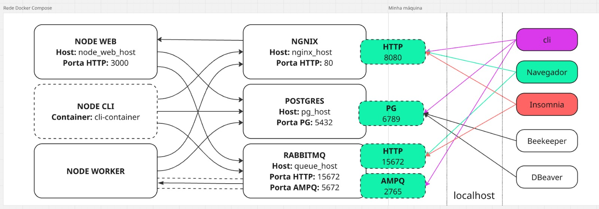

# Projeto de Sistema de Gerenciamento Escolar Infantil

O projeto visa desenvolver um sistema de gerenciamento para a Escola Infantil UniFAAT-ADS, com o objetivo de automatizar e otimizar o controle de pagamentos, presenças e atividades dos alunos, substituindo o método manual atual feito em cadernos.

---

## Pré-Requisitos
> Tecnologias para a execução e visualização da aplicação, é preciso ter elas instaladas na máquina local (host).

* Docker e Docker Compose (Subir e executar a aplicação)
* Node e npm na máquina local (Necessário para executar o projeto React, gerenciar pacotes e rodar o build do Vite.)
* (**Opcional**) Insomnia (Simulações de requisições)
* Dbeaver ou Beekeeper (Visualização do banco PostgreSQL)

---

## Sumário

1. [Instalação e Execução](#instalacao-e-execucao)
2. [Acesse](#acesse)
3. [Documentação da API](#documentação-da-api)
4. [Como Criar Elementos](#como-criar-elementos)
   - [Criar uma Rota](#criar-uma-rota)
   - [Criar um Controller](#criar-um-controller)
   - [Criar um Middleware](#criar-um-middleware)
   - [Criar um Command](#criar-um-command)
   - [Migrations do Projeto](#migrations)
   - [Seeds do Projeto](#seeds)
5. [Bibliotecas Utilizadas](#bibliotecas-utilizadas)
6. [Estrutura de Diretórios (raiz)](#estrutura-de-diretorios-raiz)
7. [Como Criar um Novo Documento Swagger](#swagger)
8. [Containers e Imagens Docker](#containers-e-imagens-docker)

---


## Instalação e Execução <a name="instalacao-e-execucao"></a>

### Siga os passos abaixo para rodar o projeto:

1. Clonar o repositório:

   ```sh
   git clone https://github.com/RafaelaBiaze/Gerenciamento-Escolar-Infantil
   ```

2. Entrar na pasta do projeto:

   ```sh
   cd Gerenciamento-Escolar-Infantil
   ```

### Iniciar Backend:

3. Depois de entrar na pasta do projeto, troque de diretório novamente para o **APP**(Onde a aplicação realmente está):

   ```sh
   cd APP
   ```

4. Criar o arquivo `.env` na raiz do projeto(dentro de APP) copiando o .env.example:

   > No windows:

   ```ini
   copy .env.example .env
   ```

   > No linux

   ```ini
   cp .env.example .env
   ```

5. Abrir o arquivo `.env` recém criado e preencher os campos abaixo:
   > Este é apenas um exemplo para o funcionamento da aplicação, mudar as credenciais abaixo não irá afetar em nada.

    ```sh
   POSTGRES_USER=meu_usuario
   POSTGRES_PASSWORD=minha_senha
   RABBITMQ_USER=meu_usuario
   RABBITMQ_PASSWORD=minha_senha
   JWT_SECRET=super_secreta
   ```

6. Instalar as dependências:

   ```sh
   npm install
   ```

7. Subir a aplicação com Docker Compose:

   ```sh
   docker-compose up --build
   ```

   > Usuários com **Docker moderno** devem usar:

   ```sh
   docker compose up --build
   ```

8. Executar as migrations utilizando UM desses comandos:

   > Container (Docker Compose tradicional):

   ```sh
   docker-compose run --rm nodecli-container migrate
   ```

   > Container (Docker Compose moderno):

   ```sh
   docker compose run --rm nodecli-container migrate
   ```

   > Host:

   ```sh
   node command migrate
   ```

9. Executar as seeds utilizando UM desses comandos:

   > Container (Docker Compose tradicional):

   ```sh
   docker-compose run --rm nodecli-container seed
   ```

   > Container (Docker Compose moderno):

   ```sh
   docker compose run --rm nodecli-container seed
   ```

   > Host:

   ```sh
   node command seed
   ```

### Iniciar Frontend

10. Entrar na pasta frontend:
    ```sh
    cd frontend
    ```

11. Instalar as dependências do React:
    ```sh
    npm install
    ```

12. Iniciar com o Vite:
    ```sh
    npm run dev
    ```
---

## Acesse <a name="acesse"></a>

- Aplicação: [http://localhost:5173](http://localhost:5173)
- Servidor: [http://localhost:8080](http://localhost:8080)
- Documentação da API: [http://localhost:8080/docs](http://localhost:8080/docs)

**Importante:** O arquivo `./Insomnia.yml` **deve** ser utilizado no Insomnia para testar as rotas.

> Pasta `Docs` fora da aplicação, é somente para arquivos de documentação do banco de dados, como MER e DER.

---

## Documentação da API

> O frontend consome a API do backend para realizar as operações de CRUD. Abaixo estão os principais endpoints utilizados:

#### Usuários
* `GET /api/users?limit=10&offset=0` - Retorna a lista paginada de usuários.
* `POST /api/users` - Cria um novo usuário (JSON Body: `{ login, email, senha, role }`).
* `PUT /api/users/:id` - Atualiza os dados de um usuário existente.
* `DELETE /api/users/:id` - Remove um usuário do sistema.

#### Professores
* `GET /api/professores?limit=10&offset=0` - Retorna a lista paginada de professores com os dados do usuário vinculado.
* `POST /api/professores` - Cria um novo professor vinculado a um `id_user`.
* `PUT /api/professores/:id` - Atualiza os dados cadastrais do professor.
* `DELETE /api/professores/:id` - Exclui o registro do professor.

#### Autenticação
* `POST /login` - Recebe `{ email, senha }` e retorna um Token JWT.

### Funcionalidades do Frontend:

1. **WebSocket e Custom Hook**
> A comunicação em tempo real foi implementada utilizando a biblioteca `socket.io`.
    - **Backend:** O servidor HTTP foi unificado com o servidor WebSocket na porta 3000 (exposto na 8080). Ele escuta o evento `atualizacao` e faz um *broadcast* (retransmite) para todos os clientes conectados.
    - **Frontend:** Foi criado um **Custom Hook** chamado `useWebSocket` (`src/hooks/useWebSocket.ts`). Esse hook gerencia a conexão única, reconexão automática e expõe a função `sendMessage` para os componentes, além de atualizar o estado quando recebe mensagens do servidor.

2. **Views EJS (Server-Side Rendering)**
> Para a renderização no servidor, foi implementada uma rota específica que utiliza a template engine **EJS**.
    - **Rota:** `GET /sobre` (Acesse em: http://localhost:8080/sobre)
    - **Funcionalidade:** Exibe a data atual do servidor e a contagem total de usuários cadastrados no banco, renderizados diretamente pelo Node.js antes de chegar ao navegador.

---

## Como Criar Elementos <a name="como-criar-elementos"></a>

### Criar uma Rota: <a name="criar-uma-rota"></a>

1. Defina o path da rota em `routes/web.js` ou `routes/api.js`
2. Associe um controller da `app/Http/Controllers/`

Exemplo (`routes/api.js`):
```js
router.get('/exemplo', MeuController);
```

### Criar um Controller: <a name="criar-um-controller"></a>

1. Crie um novo arquivo em `app/Http/Controllers/...`

```js
export default async function(request, response) {
  ...
  # Minha Lógica
  ...
  response.status(200).json({"success": "Minha resposta"});
}
```

### Criar um Middleware: <a name="criar-um-middleware"></a>

Adicione em `app/Http/Middlewares/`, por exemplo:

```js
export default async function (request, response, next) {
  console.log(`[${request.method}] ${request.url}`);
  next();
}
```

Depois registre na rota.

### Criar um Command: <a name="criar-um-command"></a>

1. Crie um arquivo em `app/Commands/NomeDoCommand.js`:

```js
export default {
    name: 'nome-comando',
    description: 'minha descrição',
    arguments: {
        ...
    },

    handle: async function ({ argument1 }) {
        console.log(argument1);
        ...
        # Minha lógica
        ...
    }
}
```

2. Execute via terminal:

```sh
node command meu-comando
```

---

### **Migrations do Projeto** <a name="migrations"></a>

As migrations deste projeto são responsáveis por versionar a estrutura do banco de dados de forma incremental e ordenada por data.

#### Localização:

Todos os arquivos de migrations ficam em:

```
./database/migrations
```

#### Formato do Arquivo:

Cada migration segue o seguinte padrão de nomenclatura:

```
YYYY_MM_DD_HH_MM_SS_nome_descritivo.js
```

Exemplo:

```
2025_06_07_00_00_00_create_roles_table.js
```

#### Estrutura do Código:

Cada migration exporta dois métodos assíncronos: `up()` e `down()`.
```js
import db from '../../config/db.js';

async function up() {
  await db.query(`
    CREATE TABLE IF NOT EXISTS roles (
        id SERIAL PRIMARY KEY,
        nome VARCHAR(155) UNIQUE NOT NULL,
        created_at TIMESTAMP WITH TIME ZONE DEFAULT CURRENT_TIMESTAMP,
        updated_at TIMESTAMP WITH TIME ZONE DEFAULT CURRENT_TIMESTAMP
    );
  `);
}

async function down() {
  await db.query(`DROP TABLE roles;`);
}

export default { up, down };
```

#### Como Criar uma Nova Migration:

1. **Defina um nome descritivo e a hora atual no início**  
2. **Implemente as funções `up()` e `down()`**  
3. **Salve o arquivo em `./database/migrations`**

#### Execução das Migrations:

A execução é feita via CLI e respeita a ordem de timestamp.

#### Boas Práticas:

- Uma migration por alteração
- Sempre implemente `down()`
- Não altere migrations antigas

---

### **Seeds do Projeto** <a name="seeds"></a>

Seeds são scripts responsáveis por popular o banco de dados com dados iniciais ou de teste.

#### Localização:

```
./database/seeds/
```

#### Nome do Arquivo:

```
001_roles_and_users.js
002_outra_seed.js
...
```

#### Estrutura do Arquivo:

```js
import bcrypt from 'bcrypt';
import RoleModel from '../../app/Models/RoleModel.js';
import UserModel from '../../app/Models/UserModel.js';

export default {
    up: async () => {
        const rows = await RoleModel.bulkCreate([
            { nome: 'ROLE_ADMIN' },
            { nome: 'ROLE_USER' }
        ]);

        const senha = "123456";

        await UserModel.bulkCreate([
            { nome: 'User1', email: 'user1@example.com', id_role: rows[0].id, senha: await bcrypt.hash(senha, 10) },
            { nome: 'User2', email: 'user2@example.com', id_role: rows[1].id, senha: await bcrypt.hash(senha, 10) },
        ])
    },

    down: async () => {
        await UserModel.destroy({
            where: {
                email: ['user1@example.com', 'user2@example.com']
            }
        });

        await RoleModel.destroy({
            where: {
                nome: ['ROLE_ADMIN', 'ROLE_USER']
            }
        });
    }
};
```

> **Importante!** Execute as migrations antes das seeds.

#### Execução das Seeds:

Ordena os arquivos e executa `up()`, com suporte a rollback via `down()`.

#### Boas Práticas:

- Escopo pequeno por seed
- Sempre implemente `down()`
- Não reutilize emails/names
- Não use em lógica de produção

---

## Bibliotecas Utilizadas <a name="bibliotecas-utilizadas"></a>

### Backend
| Biblioteca            | Finalidade                                                                 |
|-----------------------|----------------------------------------------------------------------------|
| `express`             | Framework web para Node.js usado para criar APIs e servidores HTTP.        |
| `ejs`                 | Template Engine para renderizar views no servidor (SSR).                   |
| `socket.io`           | Biblioteca para comunicação em tempo real bidirecional.                    |
| `cors`                | Middleware para habilitar CORS e permitir acesso do Frontend.              |
| `chalk`               | Biblioteca para estilizar saídas no terminal com cores e ênfases.          |
| `dotenv`              | Carrega variáveis de ambiente de um arquivo `.env` para `process.env`.     |
| `pg`                  | Cliente PostgreSQL para Node.js, usado para conexão e execução de queries. |
| `sequelize`           | ORM (Object-Relational Mapping) para trabalhar com bancos relacionais.     |
| `jsonwebtoken`        | Geração e verificação de tokens JWT para autenticação.                     |
| `bcrypt`              | Criptografia e comparação de senhas com hash seguro.                       |
| `swagger-jsdoc`       | Gera especificações Swagger a partir de JSDoc nos comentários do código.   |
| `swagger-ui-express`  | Middleware que serve a UI do Swagger para documentar e testar APIs.        |
| `express-fileupload`  | Middleware para lidar com upload de arquivos via `multipart/form-data`.    |
| `minimist`            | Faz o parsing de argumentos de linha de comando.                           |
| `cli-table3`          | Cria tabelas formatadas para exibição no terminal.                         |
| `axios`               | Cliente HTTP para fazer requisições a APIs externas.                       |
| `amqplib`             | Biblioteca cliente para comunicação com RabbitMQ via protocolo AMQP.       |
| `nodemon`             | Ferramenta que reinicia automaticamente a aplicação ao detectar mudanças.  |

### Frontend
| Biblioteca            | Finalidade                                                                 |
|-----------------------|----------------------------------------------------------------------------|
| `react`               | Biblioteca JavaScript para criar interfaces de usuário.                    |
| `typescript`          | Superset de JavaScript que adiciona tipagem estática.                      |
| `vite`                | Ferramenta de build rápida para projetos web modernos.                     |
| `axios`               | Cliente HTTP para consumir a API REST do backend.                          |
| `socket.io-client`    | Cliente para conectar ao WebSocket do backend.                             |
| `react-router-dom`    | Biblioteca de roteamento para navegar entre as views da aplicação.         |

---

## Estrutura de Diretórios (raiz) <a name="estrutura-de-diretorios-raiz"></a>

| Caminho / Pasta             | Descrição                                                                                                 |
|-----------------------------|-----------------------------------------------------------------------------------------------------------|
| `APP/`                      | **(Backend)** Raiz da aplicação Node.js/Express, contendo toda a lógica do servidor.                      |
| `APP/app/`                  | Lógica principal da aplicação organizada por domínio.                                                     |
| `APP/app/Commands/`         | Comandos CLI como `migrate`, `seed`, `dispatch`, executados com `node command <comando>`.                 |
| `APP/app/Http/`             | Código relacionado às requisições HTTP (Controllers, Middlewares).                                        |
| `APP/app/Jobs/`             | Jobs consumidos pelos workers (tarefas assíncronas).                                                      |
| `APP/app/Models/`           | Models Sequelize que representam e manipulam as tabelas do banco de dados.                                |
| `APP/bootstrap/`            | Inicializações do projeto (helpers globais, constantes, variáveis de ambiente).                           |
| `APP/config/`               | Configurações de serviços (RabbitMQ, Postgres, JWT, Sequelize, etc).                                      |
| `APP/Core/`                 | Núcleo do sistema (libs internas para CLI, Migrations, Seeds e Rotas).                                    |
| `APP/database/`             | Scripts de banco de dados: `migrations` (estrutura) e `seeds` (população inicial).                        |
| `APP/docker/`               | Dockerfiles específicos para cada serviço (Node, Nginx, Workers).                                         |
| `APP/docs/`                 | Documentação da API (Swagger/OpenAPI).                                                                    |
| `APP/resources/views/`      | **(EJS)** Templates renderizados no servidor (ex: página `/sobre`).                                       |
| `APP/routes/`               | Definição das rotas da API e Web.                                                                         |
| `APP/server.js`             | Entry point do Backend. Inicia o Express, WebSocket e escuta a porta.                                     |
| `APP/worker`                | Entry point dos workers que processam a fila RabbitMQ.                                                    |
| `frontend/`                 | **(Frontend)** Raiz da aplicação React + Vite.                                                            |
| `frontend/src/views/`       | Telas da aplicação (Login, Usuários, Professores) criadas com React.                                      |
| `frontend/src/hooks/`       | Hooks customizados (ex: `useWebSocket` para tempo real).                                                  |
| `frontend/src/services/`    | Configuração do Axios para comunicação com a API.                                                         |
| `docker-compose.yml`        | Orquestração dos containers (Web, Worker, Postgres, RabbitMQ, Nginx).                                     |

---

## Como Criar um Novo Documento Swagger:<a name="swagger"></a>

Este projeto utiliza o Swagger para documentar a API de forma modular. Cada grupo de endpoints possui um arquivo `.js` dentro do diretório `docs/`, e todos são unidos dinamicamente pelo `SwaggerCore`.

### Estrutura esperada:

```
docs/
├── 01-loginDoc.js
├── 02-colaboradorDoc.js
├── ...
```

### Criando um novo arquivo de documentação:

1. **Nomeie o arquivo com prefixo numérico e sufixo `Doc.js`**  
2. **Exporte um objeto no formato OpenAPI (Swagger 3.0)**  
3. **Salvar o arquivo em `./docs/`**
4. **O Swagger será montado automaticamente**

---

## Containers e Imagens Docker: <a name="containers-e-imagens-docker"></a>

### Containers da Aplicação:

| Container               | Dockerfile                             | Função                                                                 | Porta Interna |
|-------------------------|-----------------------------------------|------------------------------------------------------------------------|-------|
| `nodeweb-container`     | `docker/node-web/Dockerfile.dev`        | API HTTP principal (`server.js`). | 3000 |
| `nodecli-container`     | `docker/node-cli/Dockerfile`            | Executa comandos como `migrate`, `seed`, `dispatch`. Container efêmero. | - |
| `nodeworker-container`  | `docker/node-worker/Dockerfile`         | Worker que consome jobs da fila RabbitMQ.                              | - |

### Containers de Infraestrutura:

| Container              | Imagem Base               | Função                                                                 | Porta Interna |
|------------------------|---------------------------|------------------------------------------------------------------------|---------------|
| `postgres-container`   | `postgres:15`             | Banco de dados PostgreSQL usado pela aplicação.                        | 5432      |
| `rabbitmq-container`   | `rabbitmq:3-management`   | Broker de mensagens AMQP (com UI Web em `/`).                          | 5672, 15672 |
| `nginx-container`      | `nginx:1.25-alpine`       | Proxy reverso que expõe a API HTTP para fora.                          | 80      |

### Volumes Persistentes:

| Volume                         | Utilizado por                      | Finalidade                                          |
|--------------------------------|------------------------------------|-----------------------------------------------------|
| `node-modules-volume` | `nodeweb`, `nodecli`, `nodeworker`  | Evita reinstalação de dependências a cada build     |
| `postgres-data-volume`| `postgres-container`                | Persistência dos dados do banco PostgreSQL          |
| `rabbitmq-data-volume`| `rabbitmq-container`                | Persistência das filas e mensagens RabbitMQ         |

### Redes:

Todos os containers estão conectados à rede Docker personalizada:

```
project-network
```

### Portas Expostas Externamente:

| Serviço     | Porta Interna | Porta Externa | Acesso Externo                      |
|-------------|----------------|----------------|-------------------------------------|
| NGINX       | 80             | **8080**       | http://localhost:8080               |
| PostgreSQL  | 5432           | **6789**       | usado por clients (beekeeper, dbeaver, ...)/ORM/CLI               |
| RabbitMQ    | 5672, 15672    | **2765**, **15672** | AMQP e painel web http://localhost:15672 |
| Node Vite HMR    | 5173    | **5173** | http://localhost:5173  |

---

